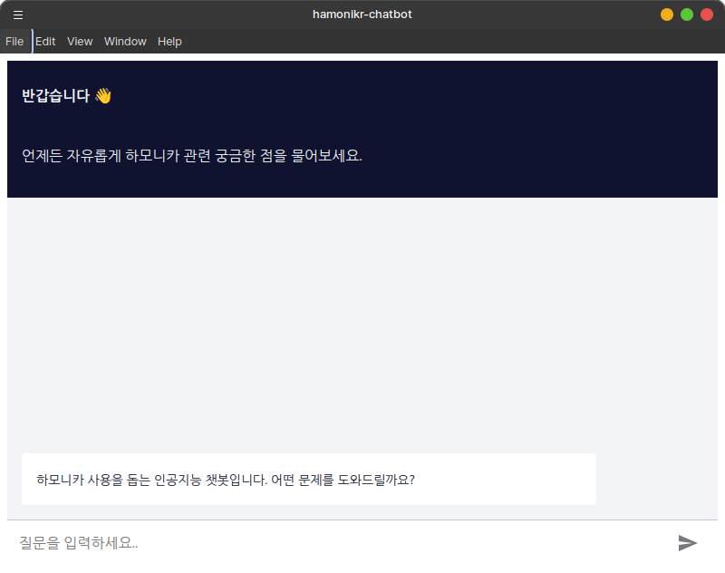

# HamoniKR Chatbot

HamoniKR Chatbot은 하모니카 사용자를 돕기 위한 인공지능 챗봇 애플리케이션입니다. 이 애플리케이션은 Electron을 사용하여 데스크톱 환경에서 실행됩니다.

## 프로젝트 개요

이 프로젝트는 Electron과 @n8n/chat 모듈을 사용하여 데스크톱 애플리케이션으로
구현된 챗봇입니다. 사용자는 인터넷 연결을 통해 챗봇과 상호작용할 수 있습니다.



- OpenAI API를 사용하여 인공지능 모델을 통해 대화를 처리합니다.
- n8n Automation을 사용하여 웹훅을 처리합니다.
- 챗봇 대화 내역은 로컬 스토리지에 저장됩니다.
- RAG 기능을 사용하여 챗봇의 지식을 확장합니다.
- Calculator 기능을 사용하여 수식 계산을 지원합니다.
- Vector DB를 사용하여 챗봇의 지식을 확장합니다.
- Search 기능을 사용하여 인터넷 검색을 지원합니다.

## 설치

### 요구 사항

- Node.js 및 npm이 설치되어 있어야 합니다.
- Electron 및 electron-builder가 필요합니다.

### 설치 방법

1. 저장소를 클론합니다.

   ```bash
   git clone https://github.com/hamonikr/hamonikr-chatbot.git
   cd hamonikr-chatbot
   ```

2. 필요한 패키지를 설치합니다.

   ```bash
   npm install
   ```

## 사용법

1. 애플리케이션을 실행합니다.

   ```bash
   npm start
   ```

2. 애플리케이션이 실행되면, 인터넷 연결 상태를 확인하고 챗봇과 상호작용할 수 있습니다.

## 빌드 및 배포

1. 애플리케이션을 빌드하여 실행 파일을 생성합니다.

   ```bash
   npm run build
   ```

2. `dist` 디렉토리 내에 생성된 `.deb` 또는 `.AppImage` 파일을 사용하여 애플리케이션을 배포할 수 있습니다.

## 기여

기여를 환영합니다! 버그 리포트, 기능 제안, 풀 리퀘스트 등을 통해 프로젝트에 기여할 수 있습니다.

## 라이선스

이 프로젝트는 MIT 라이선스 하에 배포됩니다. 자세한 내용은 LICENSE 파일을 참조하세요.

## 문의

프로젝트에 대한 문의는 [chaeya@gmail.com](mailto:chaeya@gmail.com)으로 연락해 주세요.
