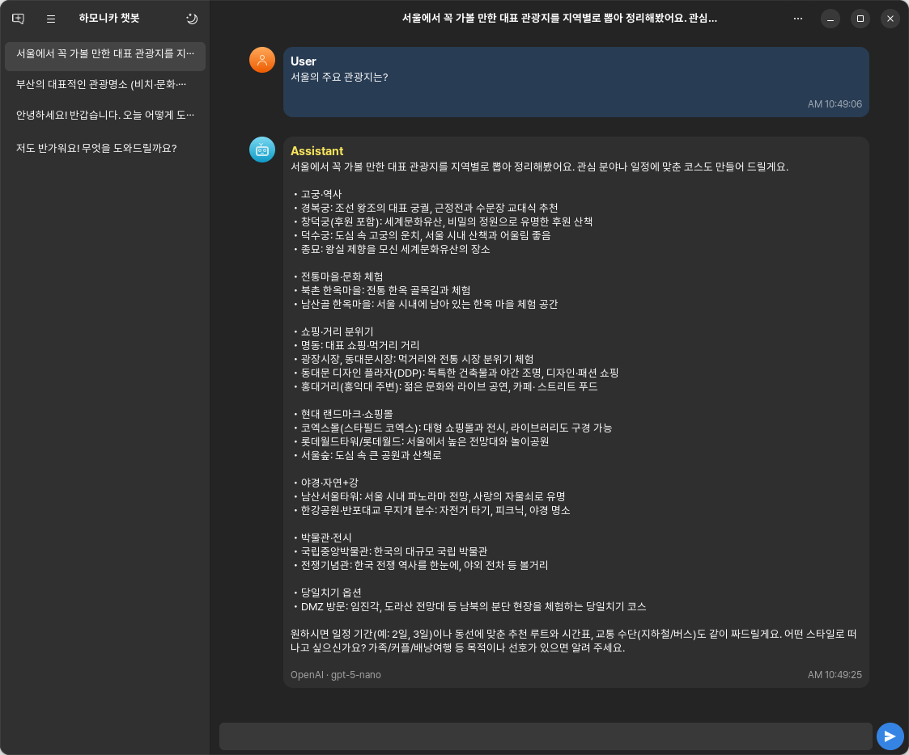

<h1 align="center">HamoniKR Chatbot</h1>

<p align="center"><strong>GTK4/Libadwaita 기반 AI 채팅 애플리케이션</strong></p>

## 소개

HamoniKR Chatbot은 업스트림 프로젝트인 Bavarder를 기반으로, HamoniKR 팀에서 한국 사용자 환경에 맞추어 배포하는 프로젝트입니다. 업스트림 소스는 다음을 참고하세요: [Bavarder/Bavarder](https://github.com/Bavarder/Bavarder).

주요 변경 사항(요약):
- 한국어 현지화 개선 및 기본 UX 한글화
- 최신 AI 프로바이더 지원 추가/정비 (OpenAI, Hugging Face 등)
- 설정 구조 리팩토링 및 내구성 강화
- 대화 목록/타이틀 자동화 등 사용성 개선

업스트림에 대한 감사와 저작권 고지는 앱의 “정보(About)” 창과 본 문서에 함께 표기됩니다.

## 스크린샷

<p align="center">
  
  <br/>
  <sub>실행 화면 예시</sub>
  
</p>

## 설치

### 소스에서 빌드(Meson)

```bash
git clone https://github.com/hamonikr/hamonikr-chatbot
cd hamonikr-chatbot
meson setup build
meson compile -C build
meson install -C build
```


## 사용법

설치 후 앱을 실행하여 프로바이더와 모델을 선택하고 대화를 시작하세요. 일부 프로바이더는 API 키 설정이 필요할 수 있습니다.

## 이슈 및 지원

문제 제기, 기능 제안은 GitHub 이슈를 이용해 주세요.

- 프로젝트 홈/이슈: https://github.com/hamonikr/hamonikr-chatbot

## 기여

포크 후 변경점을 PR로 보내주세요. 코딩 규칙, 커밋 메시지 스타일 등은 일반적인 오픈소스 관례를 따릅니다. PR에는 변경 이유와 테스트 방법을 간단히 포함해 주세요. 

## 라이선스

GPL-3.0-or-later. 세부 사항은 `COPYING` 파일을 참고하세요.

## 업스트림/크레딧

- 업스트림: [Bavarder/Bavarder](https://github.com/Bavarder/Bavarder)
- HamoniKR 유지보수: https://github.com/hamonikr/hamonikr-chatbot

